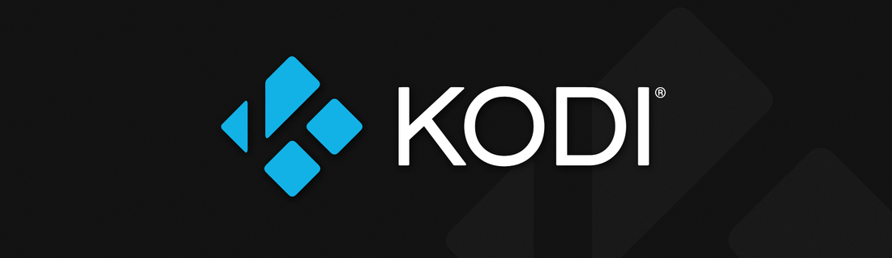

# Kodi's Documentation Home
Welcome to Kodi's documentation home. Geared at developers, it contains platform specific build guides, **[code guidelines](https://github.com/xbmc/xbmc/blob/master/docs/CODE_GUIDELINES.md)**, a **[git guide](https://github.com/xbmc/xbmc/blob/master/docs/GIT-FU.md)** streamlined for Kodi's workflow and Doxygen's resources, ready to generate **[code documentation](https://github.com/xbmc/xbmc/blob/master/docs/doxygen/README.md)**.

If you haven't done so, we encourage you to read our **[contributing guide](https://github.com/xbmc/xbmc/blob/master/docs/CONTRIBUTING.md)** first. It contains pertinent information about our development model.

## Building Kodi
Kodi uses CMake as its building system. Choose your platform below and read the guide carefully before proceeding.

  

